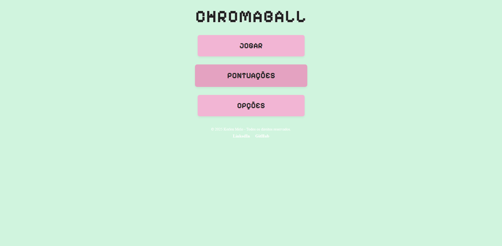

# Jogo Educacional - Chromaball

**Chromaball** é um jogo educacional simples desenvolvido para revisar conceitos fundamentais de **HTML**, **CSS** e **JavaScript**. O jogo envolve bolinhas coloridas e potes que devem ser organizados de acordo com suas cores, oferecendo uma forma divertida de exercitar a lógica e o uso de tecnologias web puras.

## Jogo Online

Veja abaixo um exemplo da tela inicial do jogo:



Você pode testar o jogo diretamente online na seguinte URL:

[**Chromaball no Vercel**](https://jogo-educacional-chromaball.vercel.app)

## Objetivo do Jogo

O objetivo do jogo é arranjar bolinhas coloridas nos potes correspondentes. Cada bolinha tem uma cor específica e você deve arrastá-las para o pote de mesma cor.

### Regras e Funcionalidades:

- **Fases**: O jogo é dividido em fases, onde a quantidade de bolinhas aumenta conforme o progresso.
- **Tempo**: Cada fase tem um tempo limitado. O tempo restante ao finalizar a fase influencia a pontuação final.
- **Pontuação**: Você ganha pontos conforme organiza as bolinhas corretamente nos potes. A pontuação também é influenciada pelo tempo que resta.
- **Home e Pontuações**: Você pode voltar ao menu a qualquer momento, visualizar suas pontuações e limpar a tabela de pontuação.
- **LocalStorage**: As pontuações são armazenadas localmente no navegador utilizando `localStorage`.

## Lógicas Implementadas

1. **Gerenciamento de Fases**: As bolinhas e potes são gerados dinamicamente conforme a fase avança. A cada fase, a dificuldade aumenta, com mais bolinhas a serem organizadas.
2. **Pontuação e Tempo**: A pontuação é calculada com base no número de bolinhas corretamente organizadas e no tempo restante ao final da fase.
3. **Interatividade com Drag-and-Drop**: O jogo utiliza a API de **Drag-and-Drop** do HTML5 para permitir que o jogador arraste as bolinhas até os potes correspondentes.

## Tecnologias Utilizadas

Este projeto foi desenvolvido utilizando **HTML**, **CSS** e **JavaScript**, sem o uso de frameworks ou bibliotecas externas. Ele foi feito para revisar e reforçar os seguintes conceitos:

- **HTML**: Estruturação da página com a criação de elementos interativos.
- **CSS**: Estilização da interface, com uso de flexbox, transições e animações.
- **JavaScript**: Lógica do jogo, manipulação do DOM, eventos e armazenamento local (localStorage).

## Como Jogar

1. Inicie o jogo clicando no botão **"Jogar"**.
2. Arraste as bolinhas coloridas para os potes de mesma cor.
3. Ao completar a fase, você verá sua pontuação e poderá avançar para a próxima fase.
4. No final do jogo, insira seu nome para salvar sua pontuação ou consulte o ranking das pontuações salvas.

## Como Executar o Projeto Localmente

1. **Clone o repositório**:

   ```bash
   git clone https://github.com/kerlenmelo/Jogo-educacional---Chromaball.git

   ```

2. **Abra o arquivo `index.html` em seu navegador**:
   - O jogo pode ser executado diretamente em qualquer navegador moderno.

## Futuras Melhorias

- **Adicionar mais fases e desafios**: Incluir diferentes tipos de desafios e aumentar a complexidade das fases.
- **Pontuação mais detalhada**: Implementar um sistema de múltiplos critérios para calcular a pontuação, como tempo total ou quantidade de tentativas.
- **Design responsivo**: Melhorar o layout para diferentes tamanhos de tela, garantindo uma boa experiência em dispositivos móveis.
